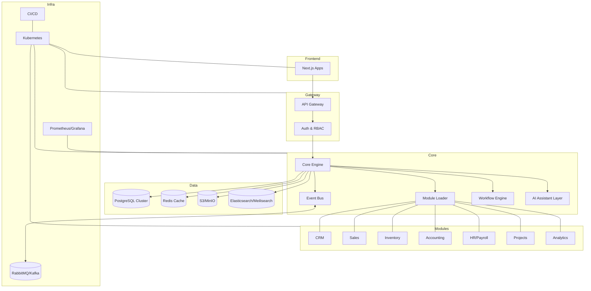
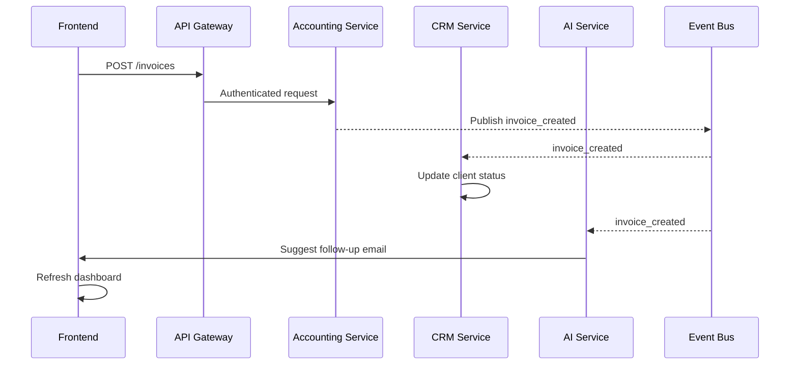

# Diagrams

## System Architecture (Mermaid)

```mermaid
flowchart TD
  subgraph Frontend
    FE[Next.js Apps]
  end

  subgraph Gateway
    APIGW[API Gateway]
    AUTH[Auth & RBAC]
  end

  subgraph Core
    CORE[Core Engine]
    LOADER[Module Loader]
    EVENT[Event Bus]
    WF[Workflow Engine]
    AI[AI Assistant Layer]
  end

  subgraph Modules
    CRM[CRM]
    SALES[Sales]
    INV[Inventory]
    ACC[Accounting]
    HR[HR/Payroll]
    PM[Projects]
    ANA[Analytics]
  end

  subgraph Data
    PG[(PostgreSQL Cluster)]
    REDIS[(Redis Cache)]
    S3[(S3/MinIO)]
    SEARCH[(Elasticsearch/Meilisearch)]
  end

  subgraph Infra
    MQ[(RabbitMQ/Kafka)]
    MON[Prometheus/Grafana]
    CI[CI/CD]
    K8S[Kubernetes]
  end

  FE --> APIGW --> AUTH --> CORE
  CORE --> LOADER
  CORE --> EVENT
  CORE --> WF
  CORE --> AI

  LOADER --- CRM & SALES & INV & ACC & HR & PM & ANA

  CORE --> PG
  CORE --> REDIS
  CORE --> S3
  CORE --> SEARCH
  EVENT <---> MQ

  K8S --- FE
  K8S --- Gateway
  K8S --- Core
  K8S --- Modules
  MON --- Core
  CI --- K8S
```

## Module Interaction (Invoice Example)

```mermaid
sequenceDiagram
  participant FE as Frontend
  participant GW as API Gateway
  participant ACC as Accounting Service
  participant CRM as CRM Service
  participant AI as AI Service
  participant BUS as Event Bus

  FE->>GW: POST /invoices
  GW->>ACC: Authenticated request
  ACC-->>BUS: Publish invoice_created
  BUS-->>CRM: invoice_created
  CRM->>CRM: Update client status
  BUS-->>AI: invoice_created
  AI->>FE: Suggest follow-up email
  FE->>FE: Refresh dashboard
```
